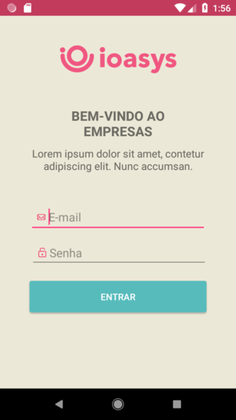

# Enterprises

An android project used to learn different kinds of Design Patterns.

  

## Description

This project is divided in 5 branches:
- **Master**: A "messy" project with code coupling and not too much single responsability.
- **MVP**: The above project with Model-View-Presenter design pattern.
- **MVVM**: The above project with Model-View-View-Model design pattern.
- **RxJava**: The final MVVM project with reactive programming paradigm.
- **Kotlin**: The RxJava project rewriten in Kotlin.

### Scope

A native Android project with:
* User login
	* The API uses OAuth 2.0 pattern and it will return 3 custom headers: *access-token*, *client* and *uid*.
	* To have access of other endpoints, the 3 custom headers are required.
* Enterprise list and filtering.
* Enterprise details.

### Testing

* **Username**: testeapple@ioasys.com.br
* **Password**: 12341234

### Libraries

* [**Retrofit**](http://square.github.io/retrofit/) for API requests
* [**GSON**](https://github.com/square/retrofit/tree/master/retrofit-converters/gson) for Json parsing
* [**Groupie**](https://github.com/lisawray/groupie) for item data binding in RecyclerView
* [**RxJava**](https://github.com/ReactiveX/RxJava) for Reactive Programming
